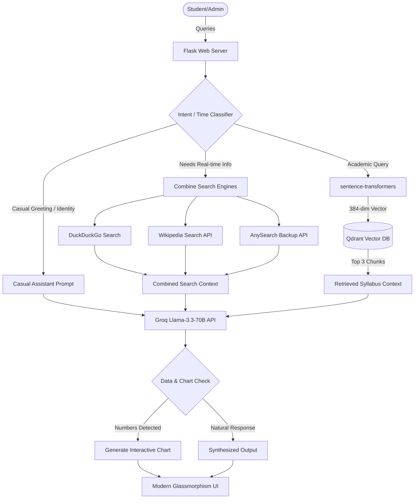

# 🎓 University RAG & OCR Chatbot

[](https://flask.palletsprojects.com/)
[](https://groq.com/)
[](https://qdrant.tech/)
[](https://huggingface.co/)
[](https://www.docker.com/)
[](https://looksa-university-chatbot.hf.space/)

A premium, production-ready AI Assistant designed for university students. Powered by **Retrieval-Augmented Generation (RAG)**, a triple-fallback **Free Web Search Engine**, automated **Tesseract OCR Ingestion**, and **Groq Cloud LLMs (Llama-3.3-70B / Llama-3.1-8B)**.

> [!TIP]
> **🚀 Live Hosted Application**: You can interact with the live version of this project running on Hugging Face Spaces here: **[looksa-university-chatbot.hf.space](https://looksa-university-chatbot.hf.space/)**

---

## 🚀 Key Features

*   📚 **Advanced RAG & Qdrant Integration** – Converts uploaded lectures, textbooks, and notes into high-quality semantic vector embeddings (via `sentence-transformers/all-MiniLM-L6-v2`) and indexes them in a **Qdrant** database.
*   📸 **Tesseract-OCR Parser Fallback** – Automatically parses text from `.pdf`, `.docx`, `.txt`, `.csv`, and `.xlsx`. If a PDF is scanned or image-based, it falls back to raw page rendering and extracts the text via **Tesseract OCR** (`pdf2image` + `pytesseract`).
*   🌐 **Triple-Engine Real-Time Search** – Dynamically detects if queries require real-time information and performs search across **DuckDuckGo**, **Wikipedia**, and **AnySearch** concurrently, synthesizing highly factual responses.
*   📊 **Visual Statistical Charting** – Automatically detects comparison data or numerical trends, parses out values, and renders beautiful charts directly in the chat UI!
*   🌍 **10-Language Support** – Fully localized conversation, voice inputs, and search capabilities in English, Sinhala, Tamil, French, Spanish, German, Chinese, Japanese, Korean, and Arabic.
*   🔐 **Secure Admin Portal** – An isolated `/admin` control center where authorized administrators can upload new syllabus material, review system statistics, and manage/delete existing indexes.
*   ☁️ **HF Dataset Synchronizer** – Automatically back up and mirror all uploaded syllabus files to a secure Hugging Face dataset in real-time.

---

## 🗺️ System Architecture



---

## ⚙️ Environment Variables

Create a `.env` file in the root directory and configure the following variables:

```ini
# Flask Secret
SECRET_KEY=your_super_secret_session_key

# Groq Cloud API
GROQ_API_KEY=gsk_your_groq_api_key

# Qdrant Vector Cloud Setup
QDRANT_URL=https://your-qdrant-instance.aws.cloud.qdrant.io
QDRANT_API_KEY=your_qdrant_api_key

# Hugging Face Storage Backup (Optional)
HF_TOKEN=your_huggingface_write_token
HF_DATASET=your_username/your_dataset_name

# Admin Authentication credentials
ADMIN_USERNAME=admin
ADMIN_PASSWORD=YourSecureAdminPassword123
```

---

## 💻 Local Setup & Installation

### 📋 Prerequisites
- Python 3.10+
- **Tesseract OCR** (Required for scanned PDF scanning)
  - **Windows**: Install via `chocolatey` (`choco install tesseract`) or download the installer and add it to your System PATH.
  - **macOS**: `brew install tesseract poppler`
  - **Linux**: `sudo apt-get install tesseract-ocr poppler-utils`

### 🛠️ Execution Steps
1. **Clone the repository:**
   ```bash
   git clone https://github.com/abdullahfaiz030/University-RAG-Chatbot.git
   cd University-RAG-Chatbot
   ```

2. **Install dependencies:**
   ```bash
   pip install -r requirements.txt
   ```

3. **Configure Environment Variables:**
   Rename `.env.example` to `.env` or create a new `.env` file using the configuration schema above.

4. **Run the Application:**
   ```bash
   python app.py
   ```
   Open `http://localhost:7860/` in your browser.

---

## 🐳 Running with Docker

You can easily build and run the chatbot inside a Docker container. The `Dockerfile` handles all system dependencies including `poppler-utils` and `tesseract-ocr` automatically.

1. **Build the image:**
   ```bash
   docker build -t university-rag-chatbot .
   ```

2. **Run the container:**
   ```bash
   docker run -p 7860:7860 --env-file .env university-rag-chatbot
   ```

---

## 🤗 Hugging Face Spaces Deployment

Since the repository contains Hugging Face metadata, you can directly import it to a Space:

1. Create a new Space on [Hugging Face](https://huggingface.co/new-space).
2. Choose **Docker** as the SDK (with Blank / Custom template).
3. Go to the Space's **Settings** tab and configure your **Repository Secrets** matching the variables in `.env`.
4. Git push your code to your Hugging Face Space repository, or connect this GitHub repo to build automatically.

---

## 📄 License
This project is licensed under the MIT License - see the [LICENSE](LICENSE) file for details.
